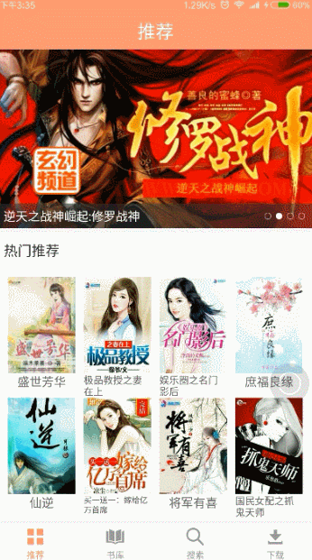
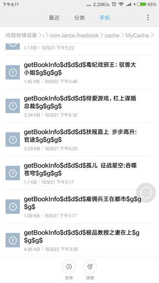

##FreeBook
###引言
>基于MVP模式开发的带缓存网络爬虫,采用最流行框架搭建,干货多多

>网络爬虫很多同学都不陌生,但是在Android上玩这个还是比较少的

>集中最近流行的框架和思维以一种简单易理解的方式实现,方便大家学习

>至于需求什么的我就不说了,对于准备毕业项目的同学学会这个你会觉得毕业项目非常easy

>[APK下载 免费下载小说  学习的同时 还能拿到不少的干货](http://fir.im/FreeBook)

###需求
网络爬虫能干嘛?
 
 - 获取对应网页某些有价值数据保存到自己服务器自己使用(很多公司的数据部这么玩 不过人家叫采集  哈哈 多么温馨的字眼)
 
 - 还有就是上面说的毕业项目 不需要搭建后台也不需要数据支持用别人的就好了
 
 - 对于有些坏坏的人来说还可以做些羞羞的软件[LCRapidDevelop](https://github.com/80945540/LCRapidDevelop)里面集成了视频播放 拿去用 我是雷锋

###首先让大家看看效果 No picture you say a jb?  gif录制效果不好  将就点看
      
###还有就是项目的结构 看看我是怎么玩转MVP的

###用到的主流框架

 - RxJava+Retrofit2+Okhttp+RxCache 实现API数据请求以及缓存(缓存不区分GET&POST 缓存策略可根据自己要求修改)
  
 - RxJava+jsoup+RxCache 实现HTMl页面爬虫数据的请求以及缓存 缓存实现与API一致 不需要另写逻辑
  
 - glide加载图片
  
 - LCRapidDevelop 下拉刷新 状态页 RecyclerView适配器 RecyclerView加载动画 等等感兴趣的自行了解 [传送门](https://github.com/80945540/LCRapidDevelop)
 
 - bga-banner 首页的Banner实现无限循环 还不错 集成简单


###功能点
 - 首页banner 以及推荐数据 根据后台接口更新(总要有点自己可控的元素嘛 比如加个广告什么的  哈哈 比如说)
  
 - 书库类别 以及类别的HTML地址等数据 通过后台接口控制 (如果哪天我觉得这个网站的资源不是很丰富 我可以很任性的直接在后台换一个)
 
 - 数据缓存 请求HTML网页再从网页上抓取想要的数据其实相对API来说耗时会比较大  缓存就显得非常重要了
 
 - 文件下载统一管理 并且调用系统支持的程序打开文件


###首先详细讲解一下RxJava+Retrofit2+Okhttp+RxCache的使用 五部曲
第一步:导包
```
    compile 'io.reactivex:rxjava:1.1.8'
    compile 'io.reactivex:rxandroid:1.2.1'
    compile 'com.squareup.retrofit2:retrofit:2.0.0-beta4'
    compile 'com.squareup.retrofit2:converter-gson:2.0.0-beta4'
    compile 'com.squareup.retrofit2:adapter-rxjava:2.0.0-beta4'
    compile 'com.github.VictorAlbertos.RxCache:core:1.4.6'
```
第二步:新建API接口
```
/**
 * API接口 
 * 因为使用RxCache作为缓存策略 所以这里不需要写缓存信息
 */
public interface MovieService {

    //获取书库分类信息
    @GET("freebook/typeconfigs.json")
    Observable<List<BookTypeDto>> getBookTypes();

    //获得首页banner以及书籍数据
    @GET("freebook/home.json")
    Observable<HomeDto> getHomeInfo();

    //获得搜索标签
    @GET("freebook/search_lable.json")
    Observable<List<String>> getSearchLable();
}
```
第三步:新建缓存接口(Html爬虫共用)
```
/**
 * 缓存API接口
 * @LifeCache设置缓存过期时间. 如果没有设置@LifeCache , 数据将被永久缓存理除非你使用了 EvictProvider, EvictDynamicKey or EvictDynamicKeyGroup .
 * EvictProvider可以明确地清理清理所有缓存数据.
 * EvictDynamicKey可以明确地清理指定的数据 DynamicKey.
 * EvictDynamicKeyGroup 允许明确地清理一组特定的数据. DynamicKeyGroup.
 * DynamicKey驱逐与一个特定的键使用EvictDynamicKey相关的数据。比如分页，排序或筛选要求
 * DynamicKeyGroup。驱逐一组与key关联的数据，使用EvictDynamicKeyGroup。比如分页，排序或筛选要求
 */
public interface CacheProviders {
    //获取书库对应类别列表  缓存时间 1天
    @LifeCache(duration = 7, timeUnit = TimeUnit.DAYS)
    Observable<Reply<List<BookInfoListDto>>> getStackTypeList(Observable<List<BookInfoListDto>> oRepos, DynamicKey userName, EvictDynamicKey evictDynamicKey);

    //获取书库分类信息缓存数据 缓存时间 永久
    Observable<Reply<List<BookTypeDto>>> getBookTypes(Observable<List<BookTypeDto>> oRepos, DynamicKey userName, EvictDynamicKey evictDynamicKey);

    //获取首页配置数据 banner 最热 最新  缓存时间7天
    @LifeCache(duration = 7, timeUnit = TimeUnit.DAYS)
    Observable<Reply<HomeDto>> getHomeInfo(Observable<HomeDto> oRepos, DynamicKey userName, EvictDynamicKey evictDynamicKey);

    //获取搜索标签  缓存时间7天
    @LifeCache(duration = 7, timeUnit = TimeUnit.DAYS)
    Observable<Reply<List<String>>> getSearchLable(Observable<List<String>> oRepos, DynamicKey userName, EvictDynamicKey evictDynamicKey);

    //获取书籍详情  缓存时间7天
    @LifeCache(duration = 7, timeUnit = TimeUnit.DAYS)
    Observable<Reply<BookInfoDto>> getBookInfo(Observable<BookInfoDto> oRepos, DynamicKey userName, EvictDynamicKey evictDynamicKey);
}
```
第四步:新建retrofit抽象类
```

/**
 *封装一个retrofit集成0kHttp3的抽象基类
 */
public abstract class RetrofitUtils {

    private static Retrofit mRetrofit;
    private static OkHttpClient mOkHttpClient;
    /**
     * 获取Retrofit对象
     *
     * @return
     */
    protected static Retrofit getRetrofit() {

        if (null == mRetrofit) {

            if (null == mOkHttpClient) {
                mOkHttpClient = new OkHttpClient.Builder().build();
            }

            //Retrofit2后使用build设计模式
            mRetrofit = new Retrofit.Builder()
                    //设置服务器路径
                    .baseUrl(Constant.API_SERVER + "/")
                    //添加转化库，默认是Gson
                    .addConverterFactory(GsonConverterFactory.create())
                    //添加回调库，采用RxJava
                    .addCallAdapterFactory(RxJavaCallAdapterFactory.create())
                    //设置使用okhttp网络请求
                    .client(mOkHttpClient)
                    .build();
        }

        return mRetrofit;
    }

}
```
第五步:新建HttpData类 用于统一管理请求
```
/*
 *所有的请求数据的方法集中地
 * 根据MovieService的定义编写合适的方法
 * 其中observable是获取API数据
 * observableCahce获取缓存数据
 * new EvictDynamicKey(false) false使用缓存  true 加载数据不使用缓存
 */
public class HttpData extends RetrofitUtils {

    private static File cacheDirectory = FileUtil.getcacheDirectory();
    private static final CacheProviders providers = new RxCache.Builder()
            .persistence(cacheDirectory)
            .using(CacheProviders.class);
    protected static final MovieService service = getRetrofit().create(MovieService.class);

    //在访问HttpMethods时创建单例
    private static class SingletonHolder {
        private static final HttpData INSTANCE = new HttpData();
    }

    //获取单例
    public static HttpData getInstance() {
        return SingletonHolder.INSTANCE;
    }

    //获取app书本类别
    public void getBookTypes(Observer<List<BookTypeDto>> observer){
        Observable observable=service.getBookTypes();
        Observable observableCahce=providers.getBookTypes(observable,new DynamicKey("书本类别"),new EvictDynamicKey(false)).map(new HttpResultFuncCcche<List<BookTypeDto>>());
        setSubscribe(observableCahce,observer);
    }
    //获取app首页配置信息  banner  最新 最热
    public void getHomeInfo(Observer<HomeDto> observer){
        Observable observable=service.getHomeInfo();
        Observable observableCache=providers.getHomeInfo(observable,new DynamicKey("首页配置"),new EvictDynamicKey(false)).map(new HttpResultFuncCcche<HomeDto>());
        setSubscribe(observableCache,observer);
    }
    //获得搜索热门标签
    public void getSearchLable(Observer<List<String>> observer){
        Observable observable=service.getSearchLable();
        Observable observableCache=providers.getSearchLable(observable,new DynamicKey("搜索热门标签"), new EvictDynamicKey(false)).map(new HttpResultFuncCcche<List<String>>());
        setSubscribe(observableCache,observer);
    }
    /**
     * 插入观察者
     *
     * @param observable
     * @param observer
     * @param <T>
     */
    public static <T> void setSubscribe(Observable<T> observable, Observer<T> observer) {
        observable.subscribeOn(Schedulers.io())
                .subscribeOn(Schedulers.newThread())//子线程访问网络
                .observeOn(AndroidSchedulers.mainThread())//回调到主线程
                .subscribe(observer);
    }

    /**
     * 用来统一处理RxCacha的结果
     */
    private  class HttpResultFuncCcche<T> implements Func1<Reply<T>, T> {

        @Override
        public T call(Reply<T> httpResult) {
            return httpResult.getData();
        }
    }

}
```
RxJava+Retrofit2+Okhttp+RxCache的搭建就是这么简单的五步就完成了,剩下的就是怎么去使用了  我来举个栗子 像这样请求数据肯定是需要写到Model里面的
```
/**
 * 获得类别数据
 */
public class HomeStackFragmentModel {

    public void LoadData(final OnLoadDataListListener listener){
        HttpData.getInstance().getBookTypes(new Observer<List<BookTypeDto>>() {
            @Override
            public void onCompleted() {

            }

            @Override
            public void onError(Throwable e) {
                listener.onFailure(e);
            }

            @Override
            public void onNext(List<BookTypeDto> bookTypeDtos) {
                listener.onSuccess(bookTypeDtos);
            }
        });
    }
}


```
想要的数据已经拿到了,故事到这里结束了,但是新的故事又开始了,吃瓜群众们你们准备好瓜子了吗?

###RxJava+jsoup+RxCache 实现HTMl页面爬虫数据的请求以及缓存 四部曲
第一步:导包  还是熟悉的套路
```
compile 'org.jsoup:jsoup:1.9.2'
```
第二步:其实就是RxJava+Retrofit2+Okhttp+RxCache 的第三步 新建缓存接口
第三步:新建自定义OnSubscribe 用于解析Html获得自己数据
```
/**
 * 其实这里面的玩法还很多
 * 这是jsop的中文文档 http://www.open-open.com/jsoup/  再牛逼的数据都能抓取
 * 其实doc.select(".bookcover h1:eq(1)");  ()里面的数据完全可以通过接口定义  达到完全控制的效果
 * 我是懒得写了  但是这个需求还是提一下  很nice的  装逼必备啊
 */
public class BookInfoHtmlOnSubscribe<T> implements Observable.OnSubscribe<T> {
    private String url;

    public BookInfoHtmlOnSubscribe(String url) {
        //获取到需要解析html地址
        this.url = url;
    }

    @Override
    public void call(Subscriber<? super T> subscriber) {
        try {
            //开始疯狂的数据抓取啦 这个我就不解释了  大家去看看文档  http://www.open-open.com/jsoup/
            Document doc = Jsoup.connect(url).get();
            Elements bookIntroduction = doc.select(".con");
            Elements bookname = doc.select(".bookcover h1:eq(1)");
            Elements bookImageUrl = doc.select(".bookcover img");
            Elements bookAuthor = doc.select(".bookcover p:eq(2)");
            Elements bookType = doc.select(".bookcover p:eq(3)");
            Elements bookLength = doc.select(".bookcover p:eq(4)");
            Elements bookProgress = doc.select(".bookcover p:eq(5)");
            Elements bookUpdateTime = doc.select(".bookcover p:eq(6)");
            String[] strs=url.split("/");
            String bookDownload="http://www.txt99.cc/home/down/txt/id/"+((strs[strs.length-1]));
            T bookInfoDto= (T) new BookInfoDto(bookImageUrl.attr("src"),bookname.text(),bookAuthor.text(),bookType.text(),bookLength.text(),bookProgress.text(),bookUpdateTime.text(),bookDownload,bookIntroduction.html());
            subscriber.onNext(bookInfoDto);
            subscriber.onCompleted();
        } catch (IOException e) {
            throw new ApiException("ERROR:数据解析错误");
        }
    }
}
```
第四步:新建HtmlData类 和上面的非常相似 哎 就不解释了 就是这么666
```
/**
 * Created by Administrator on 2016/9/14.
 */
public class HtmlData {
    //这里是设置一个缓存地址 如果地址不存在就新建一个
    private static File cacheDirectory = FileUtil.getcacheDirectory();
    //添加缓存提供者
    private static final CacheProviders providers = new RxCache.Builder()
            .persistence(cacheDirectory)
            .using(CacheProviders.class);

    //在访问HttpMethods时创建单例
    private static class SingletonHolder {
        private static final HtmlData INSTANCE = new HtmlData();
    }

    //获取单例
    public static HtmlData getInstance() {
        return SingletonHolder.INSTANCE;
    }

    //根据类型获取书籍集合
    public void getStackTypeHtml(BookTypeDto bookType, int pageIndex, Observer<List<BookInfoListDto>> observer) {
        Observable observable = Observable.create(new StackTypeHtmlOnSubscribe<BookInfoListDto>(bookType.getBookTypeUrl().replace("{Page}",pageIndex+"")));
        Observable observableCache=providers.getStackTypeList(observable,new DynamicKey("getStackTypeHtml"+bookType.getBookTypeName()+pageIndex), new EvictDynamicKey(false)).map(new HttpResultFuncCache<List<BookInfoListDto>>());
        setSubscribe(observableCache, observer);
    }
    //根据关键字搜索书籍
    public void getSearchList(String key,Observer<List<BookInfoListDto>> observer){
        try {
            //中文记得转码  不然会乱码  搜索不出想要的效果
            key = URLEncoder.encode(key, "utf-8");
        } catch (UnsupportedEncodingException e) {
            e.printStackTrace();
        }
        Observable observable=Observable.create(new StackTypeHtmlOnSubscribe<BookInfoListDto>(Constant.API_SEARCH.replace("{Key}",key)));
        Observable observableCache=providers.getStackTypeList(observable,new DynamicKey("getSearchList&"+key), new EvictDynamicKey(false)).map(new HttpResultFuncCache<List<BookInfoListDto>>());
        setSubscribe(observableCache, observer);
    }
    //获得书籍的详情
    public void getBookInfo(String bookUrl,String bookName, Observer<BookInfoDto> observer){
        Observable observable=Observable.create(new BookInfoHtmlOnSubscribe<BookInfoDto>(bookUrl));
        Observable observableCache=providers.getBookInfo(observable,new DynamicKey(bookName),new EvictDynamicKey(false)).map(new HttpResultFuncCache<BookInfoDto>());
        setSubscribe(observableCache, observer);
    }

    /**
     * 插入观察者
     *
     * @param observable
     * @param observer
     * @param <T>
     */
    public static <T> void setSubscribe(Observable<T> observable, Observer<T> observer) {
        observable.subscribeOn(Schedulers.io())
                .subscribeOn(Schedulers.newThread())//子线程访问网络
                .observeOn(AndroidSchedulers.mainThread())//回调到主线程
                .subscribe(observer);
    }
    private  class HttpResultFuncCache<T> implements Func1<Reply<T>, T> {

        @Override
        public T call(Reply<T> httpResult) {
            return httpResult.getData();
        }
    }
}
```
使用方式和RxJava+Retrofit2+Okhttp+RxCache一致 我也举个栗子好了
```
/**
 * 获取书籍详情数据
 */
public class BookInfoModel {
    public void loadData(String bookUrl,String bookName, final OnLoadDataListListener listener){
        HtmlData.getInstance().getBookInfo(bookUrl,bookName, new Observer<BookInfoDto>() {
            @Override
            public void onCompleted() {

            }

            @Override
            public void onError(Throwable e) {
                listener.onFailure(e);
            }

            @Override
            public void onNext(BookInfoDto bookInfoDto) {
                listener.onSuccess(bookInfoDto);
            }
        });
    }
}
```
好了是不是觉得特别简单  当然我只是带你们入门 真正想玩转想拓展 还是要好好的多了解了解 有吃瓜群众要问了 这个缓存是以什么形式缓存的啊 不说话 看图


###接下来就是MVP了
>最近mvp真的是火的不行啊,了解后确实觉得非常不错,解决了View和Model的耦合,对于后期的维护以及逻辑的清晰度的来说还是非常不错的

>有吃瓜群众要说了 为毛一步可以搞定的事情非要分三步

######MVP的优点：

 - 模型与视图完全分离，我们可以修改视图而不影响模型

 - 可以更高效地使用模型，因为所有的交互都发生在一个地方——Presenter内部

 - 我们可以将一个Presenter用于多个视图，而不需要改变Presenter的逻辑。这个特性非常的有用，因为视图的变化总是比模型的变化频繁。

 - 如果我们把逻辑放在Presenter中，那么我们就可以脱离用户接口来测试这些逻辑（单元测试）
 
######MVP一种编程模式 没有必要照搬 按照自己的理解去写就好  下面我例举这个APP里的书籍详情页面 来帮助大家理解

首页是Model层:业务逻辑和实体模型 由于我不是很关注实体模型 所以model层我只放业务逻辑 实体统一丢 entity
```
/**
 * 获取书籍详情数据
 */
public class BookInfoModel {
    public void loadData(String bookUrl,String bookName, final OnLoadDataListListener listener){
        HtmlData.getInstance().getBookInfo(bookUrl,bookName, new Observer<BookInfoDto>() {
            @Override
            public void onCompleted() {

            }

            @Override
            public void onError(Throwable e) {
                listener.onFailure(e);
            }

            @Override
            public void onNext(BookInfoDto bookInfoDto) {
                listener.onSuccess(bookInfoDto);
            }
        });
    }
    public interface OnLoadDataListListener<T> {
    void onSuccess(T data);
    void onFailure(Throwable e);
}
}
```
然后是我们的view层: View 对应于Activity||fragment，负责View的绘制以及与用户交互
```
/**
 * 定义一个接口来控制Activity相关操作
 */
public interface BookInfoView {
    //显示加载页
    void showProgress();
    //关闭加载页
    void hideProgress();
    //数据加载成功
    void newData(BookInfoDto data);
    //显示加载失败
    void showLoadFailMsg();
}
```
最后就是Presenter 负责完成View于Model间的交互  一个正宗的媒婆  不应该说中介  大哥你三环的房子卖吗?
```
public class BookInfoPresenter implements OnLoadDataListListener<BookInfoDto>{
    private BookInfoView mView;
    private BookInfoModel mModel;

    public BookInfoPresenter(BookInfoView mView) {
        this.mView = mView;
        mModel=new BookInfoModel();
    }

    public void loadData(String bookUrl,String bookName){
        mModel.loadData(bookUrl,bookName,this);
        mView.showProgress();
    }

    @Override
    public void onSuccess(BookInfoDto data) {
        if(data.getBookName().equals("")){
            mView.showLoadFailMsg();
        }else{
            mView.newData(data);
            mView.hideProgress();
        }
    }

    @Override
    public void onFailure(Throwable e) {
        mView.showLoadFailMsg();
    }
}
```
然而不管我们套路有多深 最终我们还是得回到Activity
```
public class BookInfoActivity extends BaseActivity implements BookInfoView {

    @BindView
    ......
    @BindView(R.id.book_info_textview_download)
    TextView bookInfoTextviewDownload;
    private String bookurl, bookname;
    private BookInfoDto bookInfoDto;
    private BookInfoPresenter presenter;

    @Override
    protected void loadViewLayout() {
        setContentView(R.layout.activity_book_info);
    }

    @Override
    protected void findViewById() {
        Intent intent = getIntent();
        bookurl = intent.getStringExtra("bookurl");
        bookname = intent.getStringExtra("bookname");
    }

    public void initview(BookInfoDto data) {
        bookInfoDto = data;
        Glide.with(mContext)
                .load(data.getBookImageUrl())
                .crossFade()
                .placeholder(R.mipmap.image_error)
                .into(bookInfoImageviewBookurl);
        bookInfoTextviewName.setText(data.getBookName());
        bookInfoTextviewAuthor.setText(data.getBookAuthor());
        bookInfoTextviewType.setText(data.getBookType());
        bookInfoTextviewLength.setText(data.getBookLength());
        bookInfoTextviewProgress.setText(data.getBookProgress());
        bookInfoTextviewUpdatetime.setText(data.getBookUpdateTime());
        bookInfoTextviewIntroduction.setText(Html.fromHtml(data.getBookIntroduction()));
    }

    @Override
    protected void setListener() {

    }

    @Override
    protected void processLogic() {
        presenter = new BookInfoPresenter(this);
        presenter.loadData(bookurl, bookname);
    }

    @Override
    protected Context getActivityContext() {
        return this;
    }

    @Override
    public void showProgress() {
        bookInfoProgress.showLoading();
    }

    @Override
    public void hideProgress() {
        bookInfoProgress.showContent();
    }

    @Override
    public void newData(BookInfoDto data) {
        initview(data);
    }

    @Override
    public void showLoadFailMsg() {
        toError();
    }

    public void toError() {
        bookInfoProgress.showError(getResources().getDrawable(R.mipmap.load_error), Constant.ERROR_TITLE, Constant.ERROR_CONTEXT, Constant.ERROR_BUTTON, new View.OnClickListener() {
            @Override
            public void onClick(View v) {
                bookInfoProgress.showLoading();
                //重试
                presenter.loadData(bookurl, bookname);
            }
        });
    }
}
```
在APP里出现的加载页面  无数据页面  网络错误页面  下拉刷新 自动加载  加载动画 viewpage的头部动画等等 
看似很高级 其实就是很轻量级的框架啦 [LCRapidDevelop](https://github.com/80945540/LCRapidDevelop)是我前段时间整合的一个快速开发框架 欢迎大家star

>网络上形形色色的教程非常之多 讲的也非常细致  细致到  看着看着我都不想看了  我呢 只是教大家怎么去入门  

>先把东西玩起来再去细致的了解 会比你先详细的了解在开发要轻松的多

>目前在线阅读还没有开发 感兴趣的朋友可以一起

>联系邮箱mychinalance@gmail.com