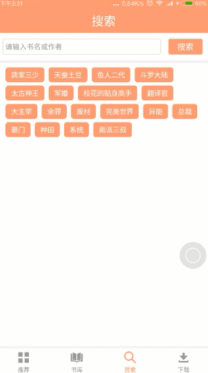
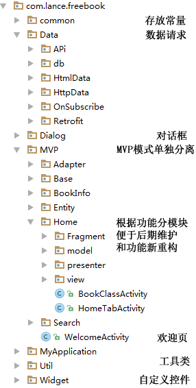

##FreeBook
###引言
>基于MVP模式开发的带缓存网络爬虫,采用最流行框架搭建,干货多多
>网络爬虫很多同学都不陌生,但是在Android上玩这个还是比较少的
>集中最近流行的框架和思维以一种简单易理解的方式实现,方便大家学习
>至于需求什么的我就不说了,对于准备毕业项目的同学学会这个你会觉得毕业项目非常easy

###首先让大家看看效果 No picture you say a jb?  gif录制效果不好  将就点看
      
###还有就是项目的结构 看看我是怎么玩转MVP的

###用到的主流框架
 - RxJava+Retrofit2+Okhttp+RxCache 实现API数据请求以及缓存(缓存不区分GET&POST 缓存策略可根据自己要求修改)
 - RxJava+jsoup+RxCache 实现HTMl页面爬虫数据的请求以及缓存 缓存实现与API一致 不需要另写逻辑
 - glide加载图片
 - LCRapidDevelop 下拉刷新 状态页 RecyclerView适配器 RecyclerView加载动画 等等感兴趣的自行了解 [传送门](https://github.com/80945540/LCRapidDevelop)
 - bga-banner 首页的Banner实现无限循环 还不错 集成简单

###功能点
 - 首页banner 以及推荐数据 根据后台接口更新(总要有点自己可控的元素嘛 比如加个广告什么的  哈哈 比如说)
 - 书库类别 以及类别的HTML地址等数据 通过后台接口控制 (如果哪天我觉得这个网站的资源不是很丰富 我可以很任性的直接在后台换一个)
 - 数据缓存 请求HTML网页再从网页上抓取想要的数据其实相对API来说耗时会比较大  缓存就显得非常重要了
 - 文件下载统一管理 并且调用系统支持的程序打开文件

###首页详细讲解一下RxJava+Retrofit2+Okhttp+RxCache的使用
第一步:导包
```
    compile 'io.reactivex:rxjava:1.1.8'
    compile 'io.reactivex:rxandroid:1.2.1'
    compile 'com.squareup.retrofit2:retrofit:2.0.0-beta4'
    compile 'com.squareup.retrofit2:converter-gson:2.0.0-beta4'
    compile 'com.squareup.retrofit2:adapter-rxjava:2.0.0-beta4'
    compile 'com.github.VictorAlbertos.RxCache:core:1.4.6'
```
第二步:新建API接口
```
/**
 * API接口 
 * 因为使用RxCache作为缓存策略 所以这里不需要写缓存信息
 */
public interface MovieService {

    //获取书库分类信息
    @GET("freebook/typeconfigs.json")
    Observable<List<BookTypeDto>> getBookTypes();

    //获得首页banner以及书籍数据
    @GET("freebook/home.json")
    Observable<HomeDto> getHomeInfo();

    //获得搜索标签
    @GET("freebook/search_lable.json")
    Observable<List<String>> getSearchLable();
}
```
第三步:新建缓存接口(HTMl爬虫公用)
```
/**
 * 缓存API接口
 * @LifeCache设置缓存过期时间. 如果没有设置@LifeCache , 数据将被永久缓存理除非你使用了 EvictProvider, EvictDynamicKey or EvictDynamicKeyGroup .
 * EvictProvider可以明确地清理清理所有缓存数据.
 * EvictDynamicKey可以明确地清理指定的数据 DynamicKey.
 * EvictDynamicKeyGroup 允许明确地清理一组特定的数据. DynamicKeyGroup.
 * DynamicKey驱逐与一个特定的键使用EvictDynamicKey相关的数据。比如分页，排序或筛选要求
 * DynamicKeyGroup。驱逐一组与key关联的数据，使用EvictDynamicKeyGroup。比如分页，排序或筛选要求
 */
public interface CacheProviders {
    //获取书库对应类别列表  缓存时间 1天
    @LifeCache(duration = 7, timeUnit = TimeUnit.DAYS)
    Observable<Reply<List<BookInfoListDto>>> getStackTypeList(Observable<List<BookInfoListDto>> oRepos, DynamicKey userName, EvictDynamicKey evictDynamicKey);

    //获取书库分类信息缓存数据 缓存时间 永久
    Observable<Reply<List<BookTypeDto>>> getBookTypes(Observable<List<BookTypeDto>> oRepos, DynamicKey userName, EvictDynamicKey evictDynamicKey);

    //获取首页配置数据 banner 最热 最新  缓存时间7天
    @LifeCache(duration = 7, timeUnit = TimeUnit.DAYS)
    Observable<Reply<HomeDto>> getHomeInfo(Observable<HomeDto> oRepos, DynamicKey userName, EvictDynamicKey evictDynamicKey);

    //获取搜索标签  缓存时间7天
    @LifeCache(duration = 7, timeUnit = TimeUnit.DAYS)
    Observable<Reply<List<String>>> getSearchLable(Observable<List<String>> oRepos, DynamicKey userName, EvictDynamicKey evictDynamicKey);

    //获取书籍详情  缓存时间7天
    @LifeCache(duration = 7, timeUnit = TimeUnit.DAYS)
    Observable<Reply<BookInfoDto>> getBookInfo(Observable<BookInfoDto> oRepos, DynamicKey userName, EvictDynamicKey evictDynamicKey);
}
```
第四步:新建retrofit抽象类
```

/**
 *封装一个retrofit集成0kHttp3的抽象基类
 */
public abstract class RetrofitUtils {

    private static Retrofit mRetrofit;
    private static OkHttpClient mOkHttpClient;
    /**
     * 获取Retrofit对象
     *
     * @return
     */
    protected static Retrofit getRetrofit() {

        if (null == mRetrofit) {

            if (null == mOkHttpClient) {
                mOkHttpClient = new OkHttpClient.Builder().build();
            }

            //Retrofit2后使用build设计模式
            mRetrofit = new Retrofit.Builder()
                    //设置服务器路径
                    .baseUrl(Constant.API_SERVER + "/")
                    //添加转化库，默认是Gson
                    .addConverterFactory(GsonConverterFactory.create())
                    //添加回调库，采用RxJava
                    .addCallAdapterFactory(RxJavaCallAdapterFactory.create())
                    //设置使用okhttp网络请求
                    .client(mOkHttpClient)
                    .build();
        }

        return mRetrofit;
    }

}
```
第五步:新建HttpData类 用于统一管理请求
```
/*
 *所有的请求数据的方法集中地
 * 根据MovieService的定义编写合适的方法
 * 其中observable是获取API数据
 * observableCahce获取缓存数据
 * new EvictDynamicKey(false) false使用缓存  true 加载数据不使用缓存
 */
public class HttpData extends RetrofitUtils {

    private static File cacheDirectory = FileUtil.getcacheDirectory();
    private static final CacheProviders providers = new RxCache.Builder()
            .persistence(cacheDirectory)
            .using(CacheProviders.class);
    protected static final MovieService service = getRetrofit().create(MovieService.class);

    //在访问HttpMethods时创建单例
    private static class SingletonHolder {
        private static final HttpData INSTANCE = new HttpData();
    }

    //获取单例
    public static HttpData getInstance() {
        return SingletonHolder.INSTANCE;
    }

    //获取app书本类别
    public void getBookTypes(Observer<List<BookTypeDto>> observer){
        Observable observable=service.getBookTypes();
        Observable observableCahce=providers.getBookTypes(observable,new DynamicKey("书本类别"),new EvictDynamicKey(false)).map(new HttpResultFuncCcche<List<BookTypeDto>>());
        setSubscribe(observableCahce,observer);
    }
    //获取app首页配置信息  banner  最新 最热
    public void getHomeInfo(Observer<HomeDto> observer){
        Observable observable=service.getHomeInfo();
        Observable observableCache=providers.getHomeInfo(observable,new DynamicKey("首页配置"),new EvictDynamicKey(false)).map(new HttpResultFuncCcche<HomeDto>());
        setSubscribe(observableCache,observer);
    }
    //获得搜索热门标签
    public void getSearchLable(Observer<List<String>> observer){
        Observable observable=service.getSearchLable();
        Observable observableCache=providers.getSearchLable(observable,new DynamicKey("搜索热门标签"), new EvictDynamicKey(false)).map(new HttpResultFuncCcche<List<String>>());
        setSubscribe(observableCache,observer);
    }
    /**
     * 插入观察者
     *
     * @param observable
     * @param observer
     * @param <T>
     */
    public static <T> void setSubscribe(Observable<T> observable, Observer<T> observer) {
        observable.subscribeOn(Schedulers.io())
                .subscribeOn(Schedulers.newThread())//子线程访问网络
                .observeOn(AndroidSchedulers.mainThread())//回调到主线程
                .subscribe(observer);
    }

    /**
     * 用来统一处理RxCacha的结果
     */
    private  class HttpResultFuncCcche<T> implements Func1<Reply<T>, T> {

        @Override
        public T call(Reply<T> httpResult) {
            return httpResult.getData();
        }
    }

}
```
RxJava+Retrofit2+Okhttp+RxCache的搭建就是这么简单的五步就完成了,剩下的就是怎么去使用了  我来举个栗子 像这样请求数据肯定是需要写到Model里面的
```
/**
 * 获取书籍详情数据
 */
public class BookInfoModel {
    public void loadData(String bookUrl,String bookName, final OnLoadDataListListener listener){
        HtmlData.getInstance().getBookInfo(bookUrl,bookName, new Observer<BookInfoDto>() {
            @Override
            public void onCompleted() {

            }

            @Override
            public void onError(Throwable e) {
                listener.onFailure(e);
            }

            @Override
            public void onNext(BookInfoDto bookInfoDto) {
                listener.onSuccess(bookInfoDto);
            }
        });
    }
}

```
想要的数据已经拿到了,故事到这里结束了,但是新的故事又开始了,吃瓜群众们你们准备好瓜子了吗?